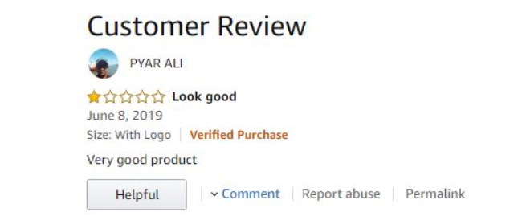

Have you ever met in your listing that there are 1 star reviews left by non-verified purchase “buyers” with very positive comment or vice-versa with 5 star reviews with a negative comment.

For e.g:-

So the solution is to not accept these types of reviews . That's what my streamlit model is all about 

<a href="#" class="button big">Create Project</a>
